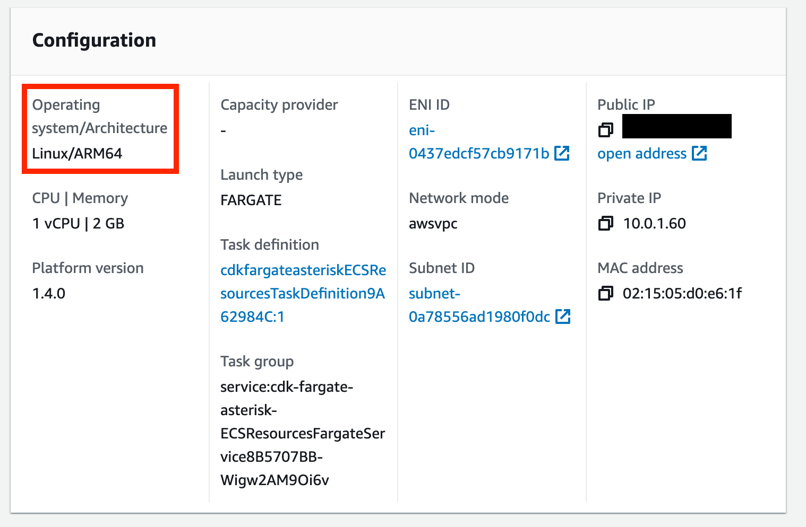
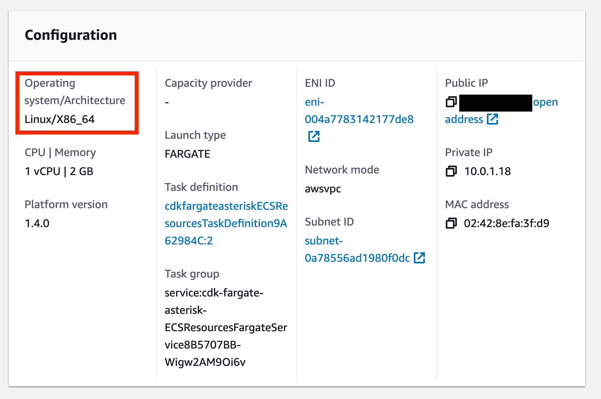

# Multiple CPU Architecture CDK Deployment of an Asterisk to ECS Fargate

This demo contains a CDK deployment of an Asterisk server to Amazon ECS using Fargate. This will allow us to deploy an Asterisk server to a Docker container.

## Docker Image

For this demo, we will be using the [andrius/asterisk](https://github.com/andrius/asterisk) Docker image.

## Asterisk Configuration

To allow for customized configuration, we will copy files from the local directory to the Asterisk server in the `Dockerfile`.

```Dockerfile
COPY config/* /etc/asterisk
COPY docker-entrypoint.sh /
RUN chmod +x /docker-entrypoint.sh
```

In this example, we are copying in several files for our configuration including a `pjsip.conf` and `extensions.conf` files.

```asterisk
[udp]
type=transport
protocol=udp
bind=0.0.0.0
external_media_address=PUBLIC_IP
external_signaling_address=PUBLIC_IP
allow_reload=yes
```

In the `pjsip.conf` file, we are simply loading a basic `udp` transport. We will configure this during deployment later.

## Multiple Build Platforms

In order to accommodate deployments from multiple platforms, we will ensure that the deployed version matches the built version.

In the `Dockerfile` we will use `${BUILDPLATFORM}` to make sure we're building using the local architecture. We need to do this because we are copying files to the image and then building it before deploying it.

```Dockerfile
FROM --platform=$BUILDPLATFORM andrius/asterisk
```

In the `ecs.ts` file, we will determine the local architecture and use that.

```typescript
let deployArch: CpuArchitecture;
const cpuArch = os.arch();
if (cpuArch === 'arm64') {
  deployArch = CpuArchitecture.ARM64;
} else {
  deployArch = CpuArchitecture.X86_64;
}
```

Then, when we create the Task, we will use that `cpuArch` as part of the build.

```typescript
this.task = new FargateTaskDefinition(this, 'TaskDefinition', {
  memoryLimitMiB: 2048,
  cpu: 1024,
  runtimePlatform: {
    operatingSystemFamily: OperatingSystemFamily.LINUX,
    cpuArchitecture: deployArch,
  },
  taskRole: asteriskTaskRole,
  volumes: [
    {
      name: 'asteriskLogs',
      efsVolumeConfiguration: {
        fileSystemId: fileSystem.fileSystemId,
        transitEncryption: 'ENABLED',
        authorizationConfig: {
          accessPointId: asteriskAccessPoint.accessPointId,
          iam: 'ENABLED',
        },
      },
    },
  ],
});
```

Now the deployed version will match the locally built version.

For example, when the Docker image is built on an M1 Mac, the CPU type will be `ARM64`.



However, if the Docker image is built on an X86 based CPU, the CPU type will be `X86_64`.



## Access the Asterisk Server

Once deployed, the Asterisk server can be accessed using [`ecs-execute`](https://docs.aws.amazon.com/AmazonECS/latest/developerguide/ecs-exec.html)

Included in the output of the CDK will be several commands that can be copied to the terminal for ssh access.

To access the running Asterisk:

- Copy/paste the `CLUSTER=` command
- Copy/paste the `Task=` command
- Copy/paste either `aws ecs execute-command` command

## Asterisk Configuration

During deployment of the Fargate container, the Dockerfile will use `docker-entrypoint.sh` as it's `ENTRYPOINT`. Everything in that file will be executed. We can use this to configure the Asterisk during deployment.

```bash
echo "METADATA: " ${ECS_CONTAINER_METADATA_URI_V4}
curl -o metadata.json ${ECS_CONTAINER_METADATA_URI_V4}/task
cat metadata.json
TASK_ARN=$( curl ${ECS_CONTAINER_METADATA_URI_V4}/task | jq -r '.TaskARN' )
echo "TASK_ARN: " $TASK_ARN
CLUSTER=$( curl ${ECS_CONTAINER_METADATA_URI_V4}/task | jq -r '.Cluster' )
echo "CLUSTER: " $CLUSTER
ENI=$(aws ecs describe-tasks --tasks $TASK_ARN --cluster $CLUSTER | jq -r '.tasks[0].attachments[0].details[1].value' )
echo "ENI: " $ENI
PUBLIC_IP=$( aws ec2 describe-network-interfaces --network-interface-ids $ENI | jq -r '.NetworkInterfaces[0].Association.PublicIp' )
echo "PUBLIC_IP: ${PUBLIC_IP}"

sed -i "s/PUBLIC_IP/$PUBLIC_IP/g" /etc/asterisk/pjsip.conf
```

With this shell script, we will determine the `PUBLIC_IP` of the container that is running and use that to configure the `pjsip.conf` file. This can be expanded to configure other parts of the Asterisk server as needed.

## Deploy/Destroy

To deploy this demo:

```bash
yarn launch
```

To destroy this demo:

```
yarn cdk destroy
```
